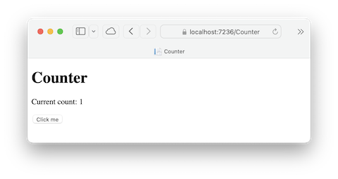
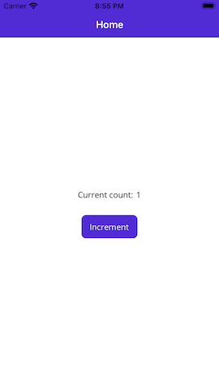
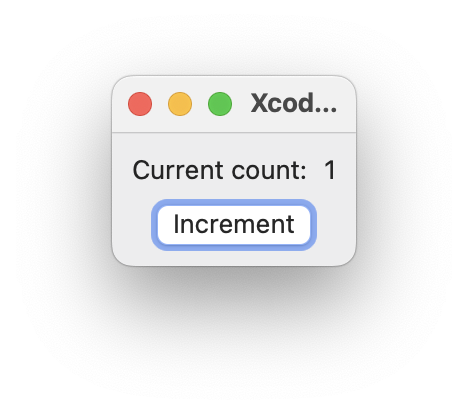

# SevenGuis
Various implementations of https://eugenkiss.github.io/7guis/tasks

# 1. Counter

<figure style="width: 30rem; height: 30rem">
  
  <figcaption>Blazor</figcaption>
</figure>

<figure style="width: 30rem; height: 30rem">
  
  <figcaption>MAUI (iPhone)</figcaption>
</figure>

<figure style="width: 30rem; height: 30rem">
  
  <figcaption>SwiftUI (macOS)</figcaption>
</figure>
